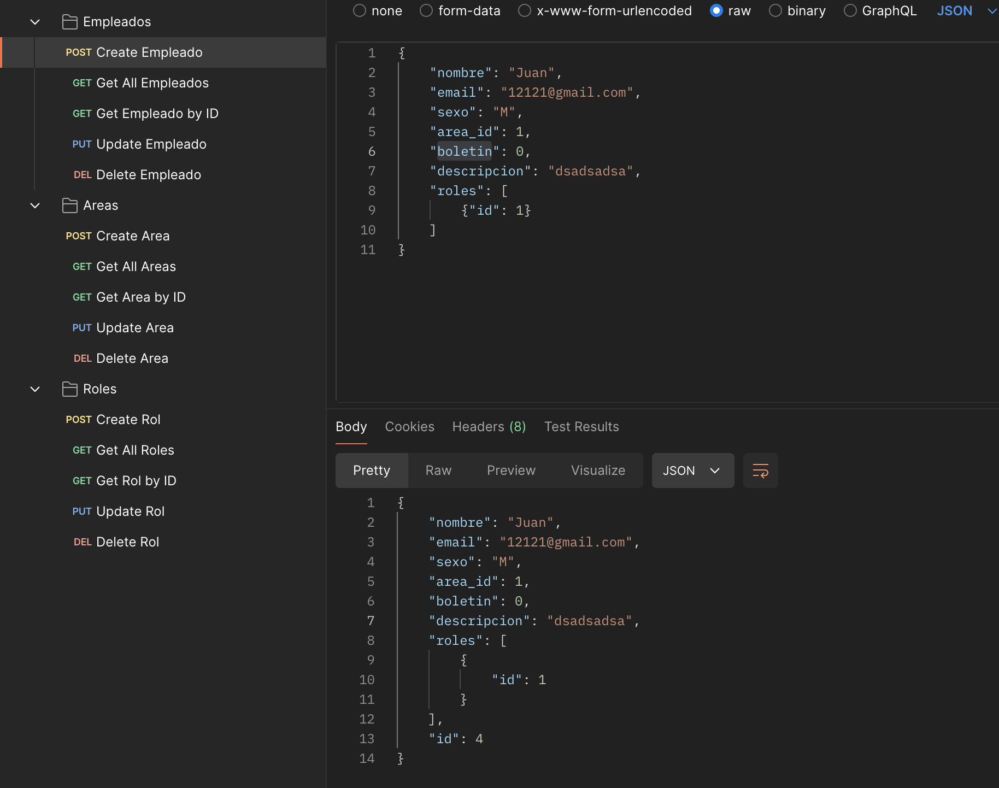
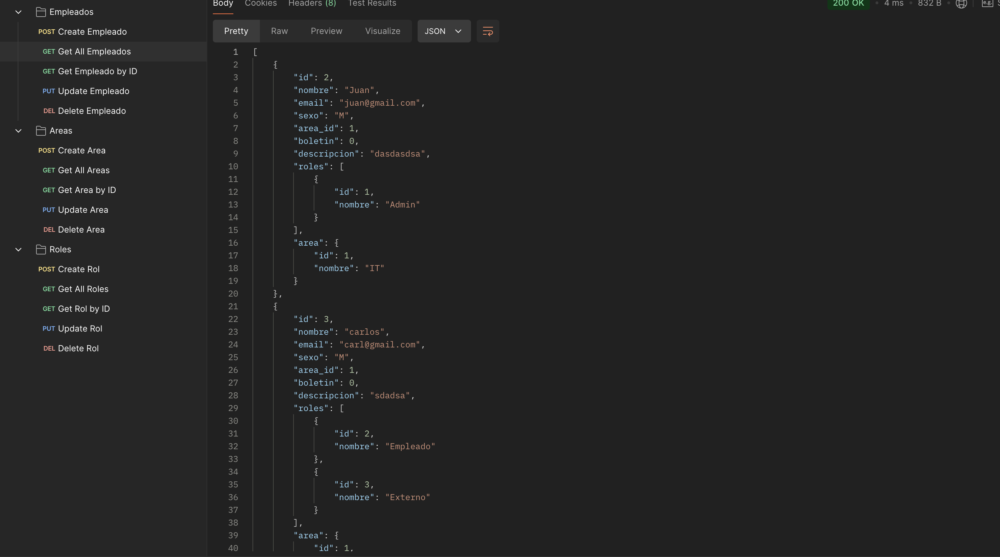

## Description

Prueba Nexura - CRUD EMPLEADOS. Desarrollado con React, TypeScript, Postman y Docker starter repository.

## Docker
```bash
$ docker-compose up --build -d
```
## Inicar proyecto
```bash
# development
$ npm run start

# watch mode
$ npm run start:dev
```

## Endpoins testing






